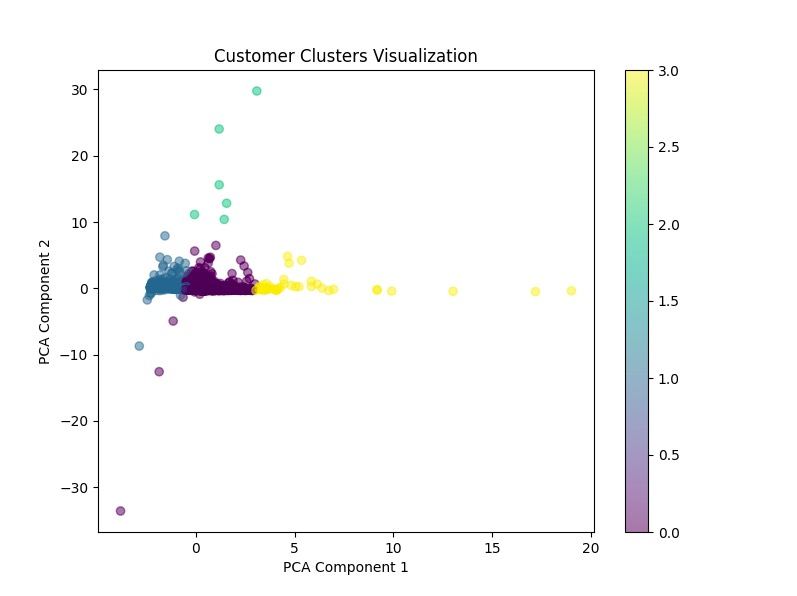

# 无监督学习实战案例：客户行为聚类分析

在本篇实战案例中，我们将使用无监督学习中的经典聚类算法——**K-Means算法**，对客户消费行为数据进行分析，以实现精准的客户细分。

## 案例背景

某电商平台拥有大量的客户消费数据，但未对客户群体进行过详细的分类和标签化，难以针对不同的客户群体实施精准营销。利用K-Means算法，我们将尝试发现客户数据中的潜在结构。

## 步骤一：数据准备

### 数据特征说明

我们使用公开数据集进行案例演示，这里以UCI的Online Retail数据集为例，数据集中包含用户交易的详细记录。

可以通过以下代码直接加载数据集：

```python
import pandas as pd

# 从公开数据源加载数据
data_url = "https://archive.ics.uci.edu/ml/machine-learning-databases/00352/Online%20Retail.xlsx"
data = pd.read_excel(data_url)

# 数据预处理，创建客户消费行为特征
data['TotalPrice'] = data['Quantity'] * data['UnitPrice']
customer_data = data.groupby('CustomerID').agg({
    'InvoiceNo': 'nunique',
    'TotalPrice': 'mean',
    'InvoiceDate': lambda x: (pd.to_datetime('2011-12-10') - x.max()).days
}).reset_index()

customer_data.columns = ['CustomerID', 'frequency', 'average_spending', 'recency']
customer_data.dropna(inplace=True)

print(customer_data.head())
```
这一步里面数据预处理的目的是将复杂的交易记录转化为简单的客户特征，这些特征（购买次数、平均消费金额、最近消费时间间隔）能够帮助我们利用聚类算法对客户进行分群，从而更好地制定针对性的营销策略。

## 步骤二：特征标准化

由于客户消费行为数据的特征尺度不同，我们首先进行标准化（如使用Min-Max Scaling或StandardScaler），确保各特征的权重相等。

```python
from sklearn.preprocessing import StandardScaler
scaler = StandardScaler()
data_scaled = scaler.fit_transform(customer_data[['frequency', 'average_spending', 'recency']])
```
特征标准化帮助我们在使用 K-Means 算法时，使得每个特征对聚类的贡献更均衡，避免某个量纲较大的特征支配距离计算，进而确保聚类结果更加合理和准确。

## 步骤三：应用K-Means算法

我们使用scikit-learn库中的K-Means算法，并通过Elbow方法确定最佳簇的数量。

```python
from sklearn.cluster import KMeans

# 使用Elbow方法选择聚类数量
import matplotlib.pyplot as plt

inertia = []
for k in range(1, 10):
    kmeans = KMeans(n_clusters=k, random_state=42)
    kmeans.fit(data_scaled)
    inertia.append(kmeans.inertia_)

# 绘制Elbow曲线
plt.figure(figsize=(8, 4))
plt.plot(range(1, 10), inertia, 'o-')
plt.xlabel('Number of clusters')
plt.ylabel('Inertia')
plt.title('Elbow Method for Optimal Clusters')
plt.show()

# 确定簇的数量，比如选择簇数为4
kmeans = KMeans(n_clusters=4, random_state=42)
customer_data['cluster'] = kmeans.fit_predict(data_scaled)
```

## 步骤四：分析聚类结果

通过对每个簇内的数据进行统计分析，我们可识别不同客户群体的特征。


```python
cluster_analysis = customer_data.groupby('cluster').mean()
print(cluster_analysis)
```
输出结果如下：
```
           CustomerID  frequency  average_spending     recency
cluster                                                       
0        15279.964815   5.313889         24.374417   40.505247
1        15362.488458   1.833795         27.336548  247.875346
2        15742.833333   2.166667       2248.350741   89.500000
3        15141.232558  69.162791         93.383015    3.953488
```

聚类结果分析，由上面的数据可得出：
- **簇0**：低消费、适中频次、近期消费客户
（平均每人消费约24元，购买次数适中约5次，最近消费约40天前）
- **簇1**：低消费、低频次、长时间未消费客户
（平均消费约27元，购买次数不足2次，距离最近一次消费约248天）
- **簇2**：高消费、低频次客户
（平均每次消费高达2248元，但购买次数仅约2次）
- **簇3**：中等消费、高频次、近期消费客户
（平均每次消费约93元，但购买次数极高约69次，最近消费仅约4天前）

```python
# 可视化聚类结果（使用降维技术PCA进行二维可视化）
from sklearn.decomposition import PCA

pca = PCA(n_components=2)
pca_result = pca.fit_transform(data_scaled)
customer_data['pca_one'] = pca_result[:,0]
customer_data['pca_two'] = pca_result[:,1]

plt.figure(figsize=(8,6))
plt.scatter(customer_data['pca_one'], customer_data['pca_two'], c=customer_data['cluster'], cmap='viridis', alpha=0.5)
plt.xlabel('PCA Component 1')
plt.ylabel('PCA Component 2')
plt.title('Customer Clusters Visualization')
plt.colorbar()
plt.show()
```
可视化效果如下：


## 步骤五：应用结果

根据聚类分析结果，可实施不同的营销策略，例如：

- 对高价值客户（如簇0）推送高端商品和会员服务。
- 对长期未消费的客户（如簇1）实施激活策略，例如促销折扣。

## 实践总结

本次实战案例展示了无监督学习如何有效地从未标记数据中挖掘隐藏模式，帮助企业进行客户细分和精准营销，实现商业价值最大化。

