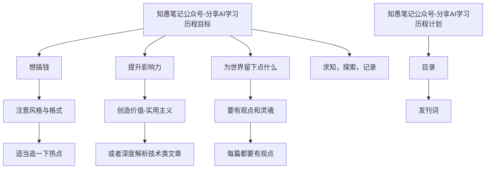
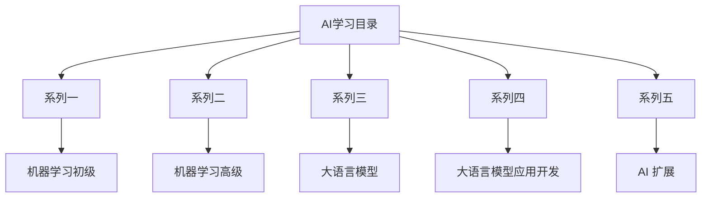

# 这里记录微信公众号的相关内容

```mermaid
graph TD
    A1 --> B1[想搞钱]
    B1 --> C111[注意风格与格式]
    C111 --> D12[适当追一下热点]
    B0 --> C22[要有观点和灵魂]
    C22 --> D3[每篇都要有观点]
    A1 --> B0001[提升影响力]
    A1 --> B0002[求知，探索，记录]
    B0001 --> C11[创造价值-实用主义]
    C11 --> D122[或者深度解析技术类文章]

    A2[知愚笔记公众号-分享AI学习历程计划] --> B0003[目录]
    B0003 --> D2[发刊词]
    A1[知愚笔记公众号-分享AI学习历程目标] --> B0[为世界留下点什么]
```

## 以下为公众号的目录划分

```mermaid
graph TD
    A1[AI学习目录] --> B1[系列一]
    B1 --> C1[机器学习初级]
    A1 --> B2[系列二]
    B2 --> C2[机器学习高级]
    A1 --> B3[系列三]
    B3 --> C3[大语言模型]
    A1 --> B4[系列四]
    B4 --> C4[大语言模型应用开发]
    A1 --> B5[系列五]
    B5 --> C5[AI 扩展]

```
