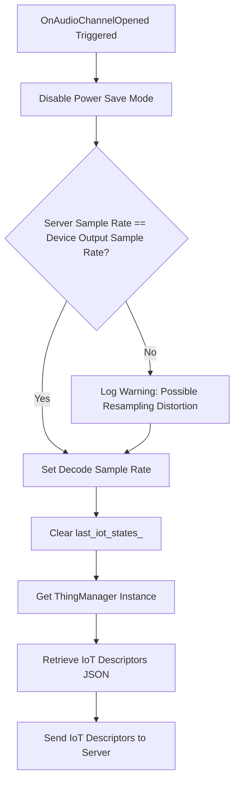
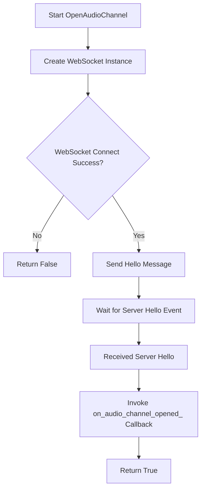
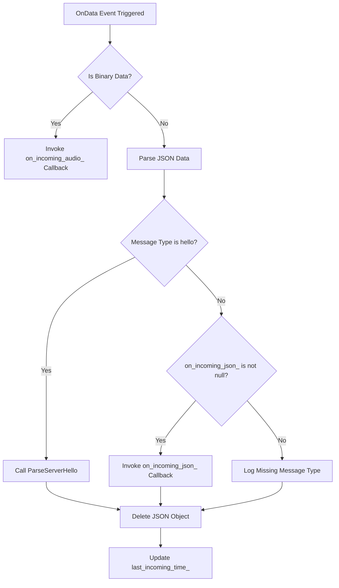

```mermaid
graph TD
    A[OnAudioChannelOpened Triggered] --> B[Disable Power Save Mode]
    B --> C{Server Sample Rate == Device Output Sample Rate?}
    
    C -- No --> D[Log Warning: Possible Resampling Distortion]
    C -- Yes --> E[Set Decode Sample Rate]
    
    D --> E
    E --> F[Clear last_iot_states_]
    
    F --> G[Get ThingManager Instance]
    G --> H[Retrieve IoT Descriptors JSON]
    H --> I[Send IoT Descriptors to Server]
```

```mermaid
graph TD
    A[Start OpenAudioChannel] --> F[Create WebSocket Instance]
    F --> AA{WebSocket Connect Success?}
    AA -- No --> AD[Return False]

    AA -- Yes --> AE[Send Hello Message]
    AE --> AF[Wait for Server Hello Event]
    
    AF --> AG[Received Server Hello]
    AG --> AK[Invoke on_audio_channel_opened_ Callback]

    AK --> AM[Return True]
```

```mermaid
graph TD
    A[OnData Event Triggered] --> B{Is Binary Data?}
    B -- Yes --> C[Invoke on_incoming_audio_ Callback]
    B -- No --> D[Parse JSON Data]

    D --> E{Message Type is hello?}
    E -- Yes --> F[Call ParseServerHello]
    E -- No --> G{on_incoming_json_ is not null?}
    G -- Yes --> H[Invoke on_incoming_json_ Callback]
    G -- No --> I[Log Missing Message Type]

    F --> J[Delete JSON Object]
    H --> J
    I --> J
    J --> K[Update last_incoming_time_]

```