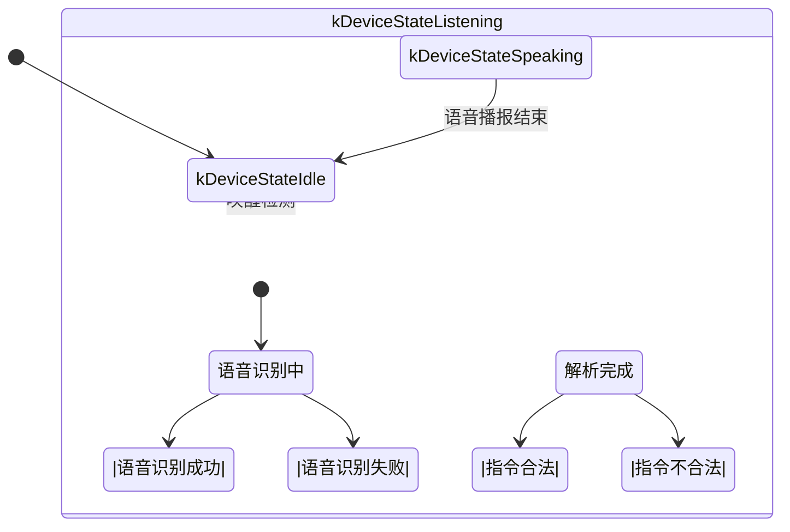

```mermaid
stateDiagram
    [*] --> kDeviceStateIdle

    state kDeviceStateListening {
        [*] --> 语音识别中

        语音识别中 -->|语音识别成功| 解析完成
        语音识别中 -->|语音识别失败| kDeviceStateIdle

        解析完成 -->|指令合法| kDeviceStateSpeaking
        解析完成 -->|指令不合法| kDeviceStateIdle
    }

    kDeviceStateIdle --> kDeviceStateListening : 唤醒检测
    kDeviceStateSpeaking --> kDeviceStateIdle : 语音播报结束
```
```mermaid
sequenceDiagram
    participant A as 用户
    participant B as 系统
    A->>B: 请求数据
    B->>A: 返回数据
